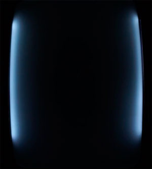

# empty-screentro
EmptyScreentro - 128 bytes intro for Vectrex

Just an experiment to display something beyond the bounds of screen.

AS09 Assembler for M6809 v1.41/Win by Frank A. Kingswood was used

If you don't have Vectrex, check out Youtube video: 
http://www.youtube.com/watch?v=HP0M89IQiQI

License: MIT
